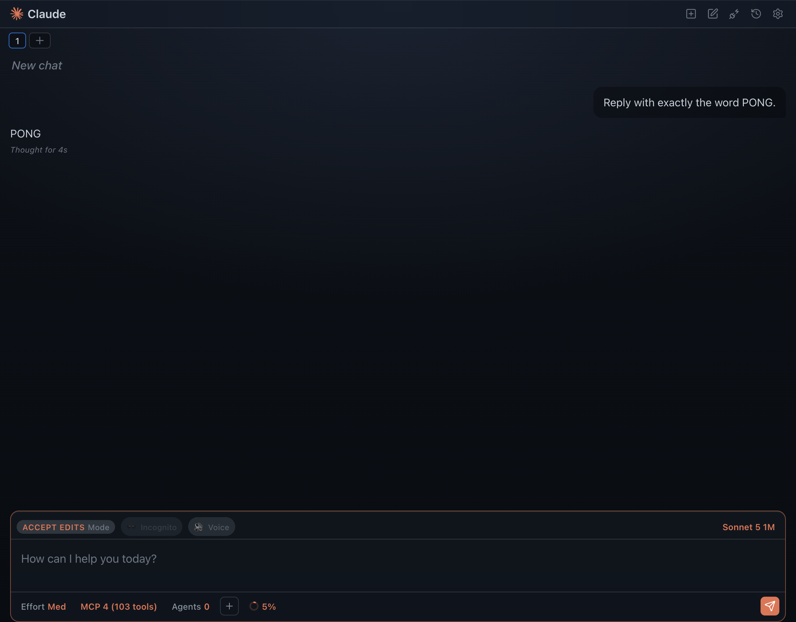
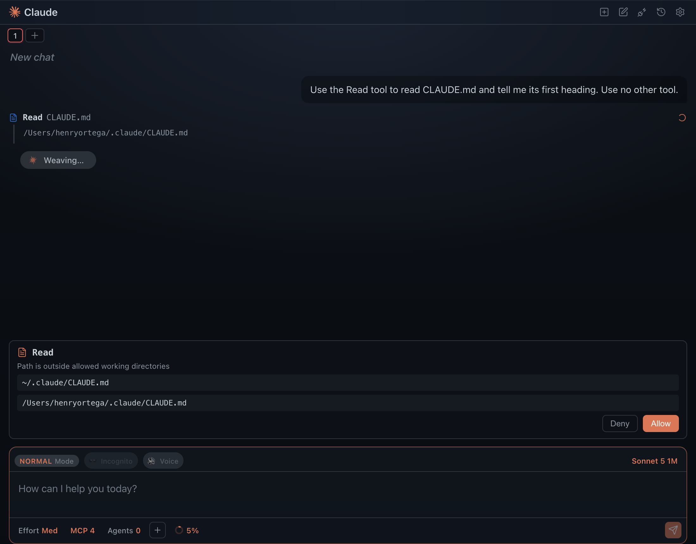
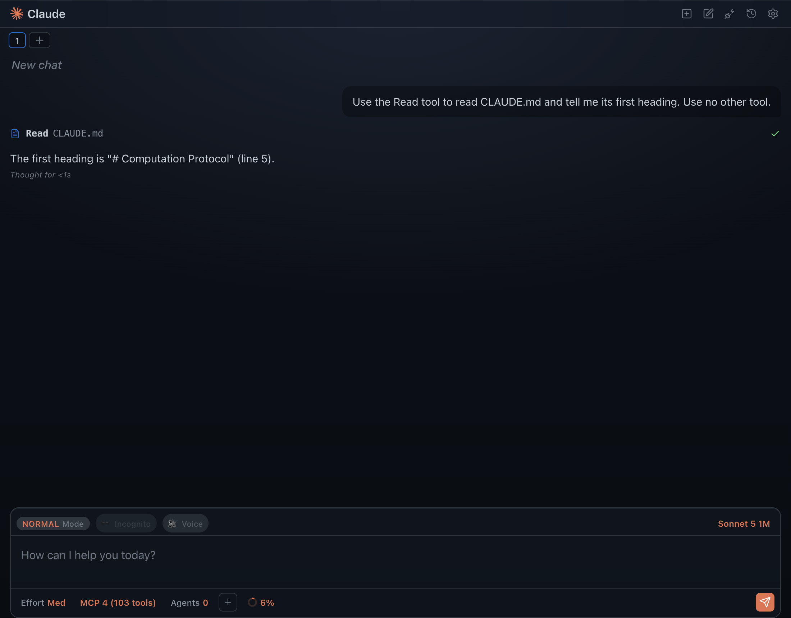
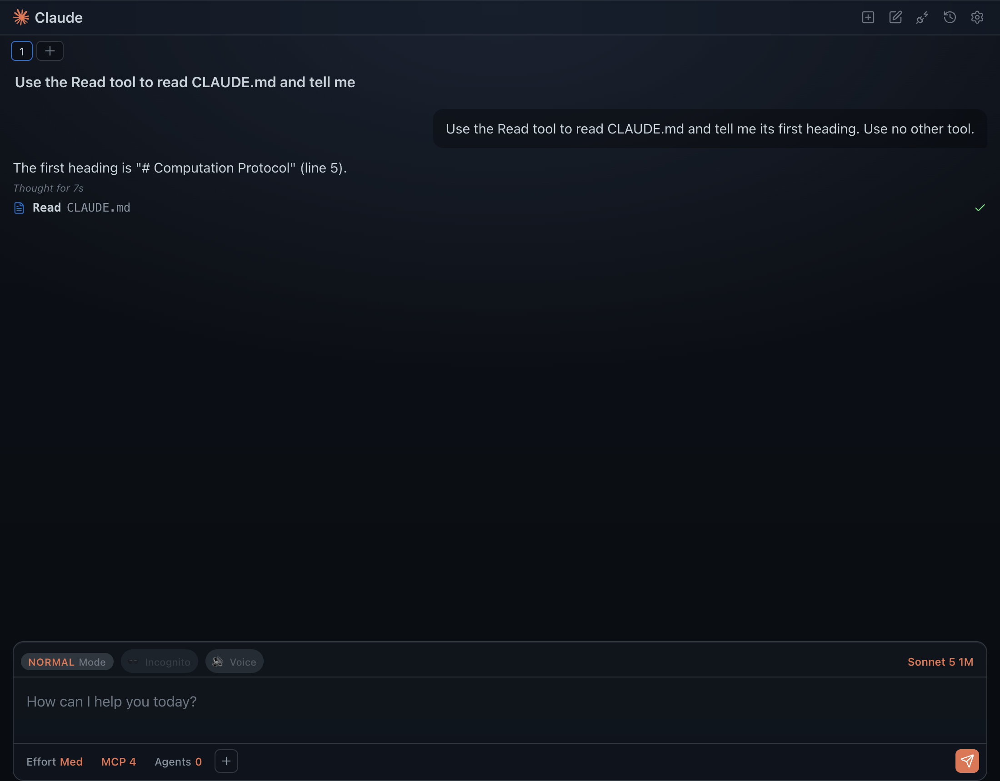
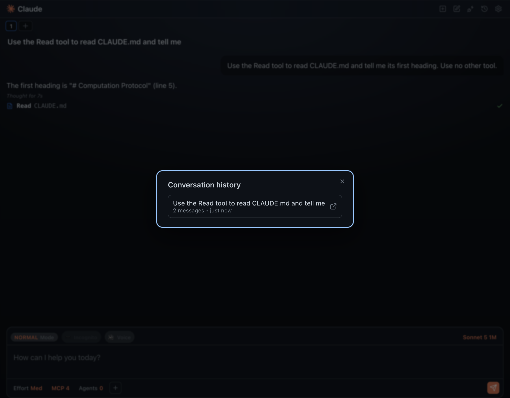
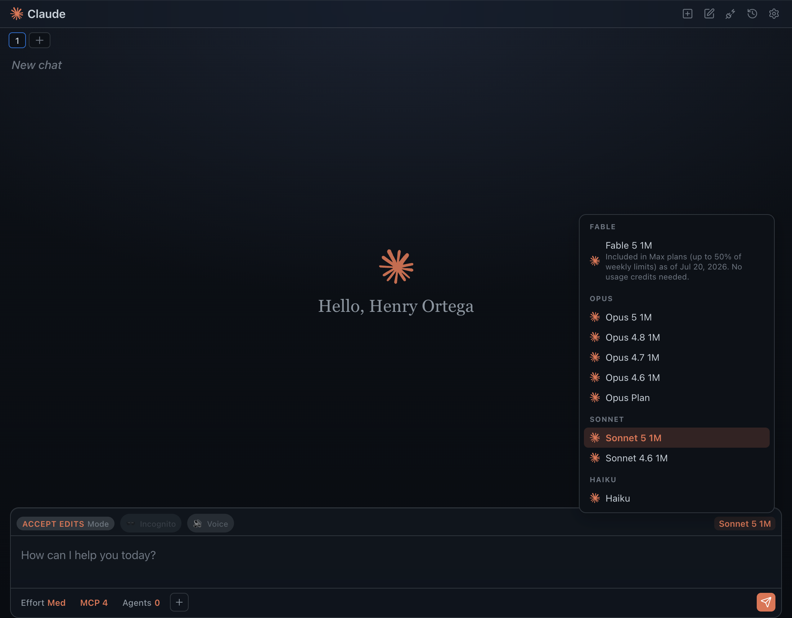
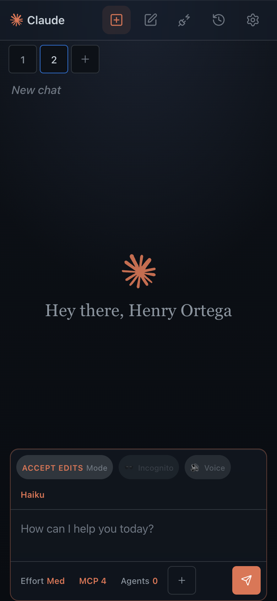
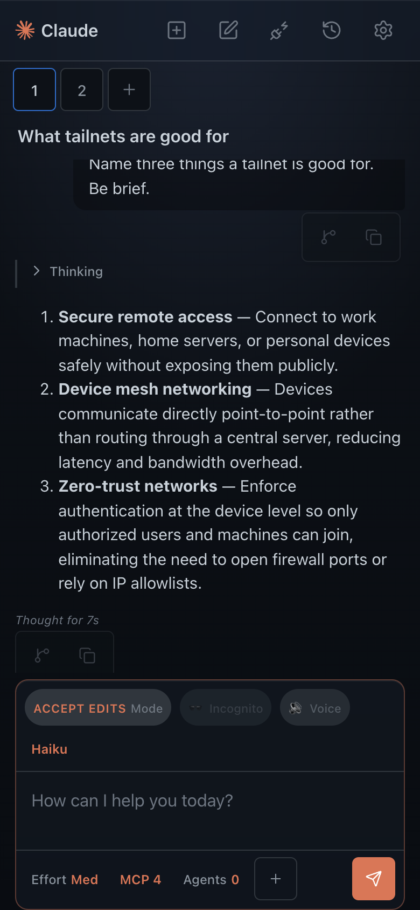
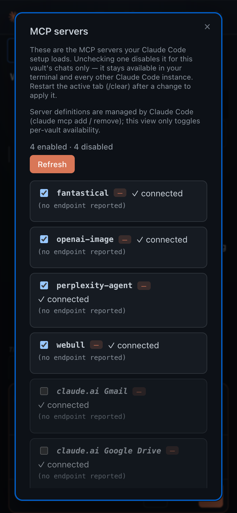

# Wave 2 — the browser client (`ios-web/` + `src/platform/remote/`)

The full claude-cli-chat UI — tabs, composer, message rendering, tool rows,
approvals, model/effort/mode pills, history, MCP manager — running in a browser
against the Vault Gateway daemon. Same `src/view` code the Obsidian plugin and
the Electron shell run; the only thing that changed is what sits behind
`PluginHost.subprocessManager`.

Contract: [`CONTRACTS.md`](CONTRACTS.md).

## The remote seam

| File | Role |
|---|---|
| `src/platform/remote/transport.ts` | `GatewayTransport` — the one port everything remote compiles against. Types only. |
| `src/platform/remote/GatewayConnection.ts` | The single shared WebSocket: ticket mint, `subscribe` with per-tab `since`, exponential-backoff reconnect, 30 s `ping` with a pong deadline, per-tab `lastSeq`, throttled `native.setState`, `resync` fan-out. |
| `src/platform/remote/RemoteSubprocessManager.ts` | `SubprocessManagerLike` + `RemoteTabSession` (`TabSessionLike`) over the gateway. |
| `src/platform/remote/RemoteFileStorage.ts` | `FileStorage` mapped onto the daemon's routes (table below). |
| `src/platform/remote/RemoteHost.ts` | `PluginHost`: catalogs, MCP list, title generation, device settings. |
| `src/platform/remote/RemoteSpeech.ts` | Voice mode over the native `speak` bridge (AVSpeechSynthesizer). |
| `ios-web/src/native.ts` | The WKWebView bridge, plus a desktop-browser fallback for development. |
| `ios-web/src/platform.ts` | `Platform` over `src/platform/dom/*`. |
| `ios-web/src/vault.ts` | `VaultFeatures` (the @-mention index) from a `GET /files` snapshot. |
| `ios-web/src/shell.ts` | `IosChatShell` — the port of `DesktopChatShell`. |
| `ios-web/src/renderer.ts` | Boot: `__vaultgw.dispatch` first, then config, platform, host, shell, socket. |
| `ios-web/ios.css` | Glass + touch layer, loaded after `styles.css` and `desktop.css`. |
| `ios-web/dev-server.mjs` | Static host for `ios/Web/` plus a `/gw/*` reverse proxy (WebSocket upgrade included). |

### Engine mapping

| `TabSessionLike` | Gateway |
|---|---|
| `spawn(tabId, opts)` | `PATCH /tabs/:id` with model / effort / permissionMode. No child starts here — the daemon spawns lazily on the first turn and respawns with `--resume` after an LRU eviction, invisibly. |
| `sendUserText` / `sendUserContent` | `POST /tabs/:id/turn` |
| `approve` / `deny` | `POST /tabs/:id/approve` |
| `dispose()` | `POST /tabs/:id/abort` (the desktop kills the child on a model change; abort is the equivalent and the session id survives) |
| `onEvent` | `event` frames, raw stream-json, in seq order |
| `onExit` | `tab_status` `exited` / `error`. `idle` maps to `ready`: an evicted tab is alive, just childless. |
| `onStderr` | `tab_status.stderrTail`, deduped against what was already forwarded |
| `getPendingApprovals` | `approval_request` minus `approval_resolved` |

Client → server actions all go over **HTTP**, not the socket, even though the
socket accepts them: HTTP returns a status code (409 `busy`, 503 `no_capacity`,
404 `no_such_tab`) and the socket's `error` frame does not say which request it
belonged to. The socket carries the inbound stream, `subscribe` and `ping`.

`TabSession`'s `earlyErrors` queue is replicated (and extended to events, exits
and stderr): the remote path's window between `spawn()` and TabController
binding its listeners is wider than the local one, not narrower. Listener
identity is preserved too — `spawn()` returns the existing session unless it is
terminal, so TabController's `if (this.session === s)` guards keep working.

### Storage mapping

Store dir `.claude-cli-chat/ios`, matching the daemon's
`new Persistence(null, ".claude-cli-chat/ios")`.

| Path | Read | Write |
|---|---|---|
| `<store>/tabs.json` | `GET /tabs` | `PATCH /tabs/:id` for a changed title, and `{active:true}` for the active tab. Creation and deletion are explicit `POST`/`DELETE` from the shell — the daemon mints tab ids. |
| `<store>/conversations/<id>.json` | `GET /tabs/:id` | no-op (the daemon projects and persists the conversation from the stream it is already parsing) |
| `<store>/conversations/<id>.meta.json` | synthesized from `GET /tabs/:id` | no-op |
| `.claude/mcp.json` | `{disabledServers}` from `/catalog`'s `mcpServers[].enabled` | `POST /mcp/disable` |
| `.claude/settings.json` | `{permissions:{allow}}` from `GET /permissions` | `POST /permissions/allow` with the additions only |

`writeJsonAtomic` stages to `<path>.<token>.tmp` and renames; there is no
staging area on the far end, so a `.tmp` write is held in memory and the
**rename** performs the mapped call. `.bak` paths are accepted and discarded.
`basePath()` is `null`, which is the condition `Persistence.flushSync()`
already degrades to a no-op on.

## What is off on iOS, and why

| Feature | State | Why |
|---|---|---|
| Remote Control | removed from the header | A macOS PTY flow (`pty.fork`) on the Mac. `createJsonlTailer` / `createRemoteControlSession` are absent. |
| Environment snippets | removed from the header | Authored in a settings file on the Mac; the phone has no editor for them. |
| `bypassPermissions` | row removed from the mode popup | A phone tab may never run unprompted tools. `/catalog` omits it and the daemon coerces it, so leaving the row would offer a choice that silently does nothing. |
| TC001 state (`stateEmitter`) | absent | The daemon already mirrors state to `/tmp/claude_state.ios`; a second writer would fight it. |
| Nested subagent rows (`createSubagentTracker`) | absent | Tails a transcript on the Mac's disk. Tool rows degrade to "no nested events", the same degradation a match failure already produces. |
| Create-subagent form (`createSubagentFile`) | absent | Writes to `~/.claude/agents` on the Mac. |
| Open / reveal in Finder (`openPathExternally`) | absent | `open(1)` would run on the wrong machine. |
| Incognito session-file cleanup (`removeSessionFiles`) | absent | The daemon owns that disk and cleans up itself. |
| Removing a permission allowlist entry | no-op | `POST /permissions/allow` only adds. Un-trusting a folder stays a desktop action. |
| MCP server endpoint / transport | shown as "no endpoint reported" | `/catalog` carries name, enabled and status, not the endpoint string. |
| Voice pause / per-channel stop | stop only | The bridge exposes `speak` and `speak {stop:true}`; AVSpeechSynthesizer has one queue. A button that claimed to pause would be lying. |
| Window lock | removed | The daemon is the single writer of its own store; two clients is a supported case, not a corruption risk. |
| "New chat" (header) | closes the tab and opens a fresh one | Clearing in place would wipe the UI while the daemon still held the old session id, so the next turn would `--resume` a conversation the user believes they discarded. |

## Screenshots

Captured against the live daemon at `100.96.112.74:8788` through
`ios-web/dev-server.mjs`.

| | |
|---|---|
|  | **01** — a turn streamed end to end (`Reply with exactly the word PONG.`). |
|  | **02** — permission mode `default`, `Read` outside the working directory, approval card rendered from the `control_request` event frame. |
|  | **03** — after Allow: the tool row, its result, and the assistant's answer. |
|  | **04** — after a page reload: tabs and conversation restored from `GET /tabs` + `GET /tabs/:id`. |
|  | **05** — History, backed by the daemon's tab list. |
|  | **06** — the model pill's picker, populated from `/catalog`. |
|  | **10** — 390×844: welcome screen, glass header and composer over the gradient. |
|  | **11** — 390×844: a conversation, message actions always visible at reduced opacity. |
|  | **12** — 390×844: the MCP manager, reading enabled/disabled from `/catalog`. |

## Running it without Xcode

```sh
npm run build:ios
node ios-web/dev-server.mjs http://100.96.112.74:8788   # or 127.0.0.1:8788
```

Open `http://127.0.0.1:5173/` and, once:

```js
localStorage.setItem("vaultgw.dev.token", "<~/.config/vault-gateway/token>")
```

The dev server exists because the daemon emits no CORS headers (it was written
for a WKWebView, which is same-origin with a custom scheme handler). Proxying
`/gw/*` makes every request first-party. The WebSocket upgrade is a raw socket
pipe: nothing in it parses a frame, so it cannot get framing wrong.

## Two wave-1 bugs found and fixed here

**1. The daemon's WebSocket handshake was rejected by every real browser.**
`scripts/gateway/src/ws.ts` computed `Sec-WebSocket-Accept` with a mistyped RFC
6455 GUID (`…95CA-5AB0DC85B11F` instead of `…95CA-C5AB0DC85B11`), and
`scripts/gateway/test/ws-client.mjs` carried the same typo — so the smoke test
passed while no browser could connect. Chrome's error was
`Incorrect 'Sec-WebSocket-Accept' header value`, and the client's reconnect
backoff simply retried forever.

This is also the real explanation for the CONTRACTS.md note claiming Node
24.14's built-in `WebSocket` "fails EVERY plaintext ws:// handshake on this
machine": undici was validating the accept value correctly and the daemon was
wrong. Both constants are fixed, with the RFC's own example vector
(`dGhlIHNhbXBsZSBub25jZQ==` → `s3pPLMBiTxaQ9kYGzzhZRbK+xOo=`) written into the
comment so a future typo is checkable. `smoke.mjs` still passes.

Two one-line constants in `scripts/gateway/` is outside this change's declared
ownership; it was unavoidable, since without it the wave-2 deliverable cannot
connect from any browser, WKWebView included.

**2. A restored tab that never ran spawns with `--resume`.** Fixed in the
integration pass (see [`INTEGRATION.md`](INTEGRATION.md)); the description
below is what wave 2 found.
`TabEngine` treats a tab rehydrated from disk as having an established session,
so a tab created (`POST /tabs`, which mints a session id) but never given a turn
before the daemon restarts spawns with `--resume <uuid>` for a conversation that
does not exist. The CLI exits 1 with `No conversation found with session ID`,
and the turn surfaces as `error_during_execution`. The fix belongs in
`scripts/gateway/src/engine.ts`: persist `sessionEstablished` alongside the
session id, or fall back to `--session-id` when a resume fails.

## Client-side fixes this wave needed

- **Foreign values in the tab store.** The daemon's store is not exclusively
  this client's: the smoke test posts `model: "haiku"`, and a raw CLI model id
  can be PATCHed by anything. `TabController` validates model/effort/mode before
  *spawning* but hands `state.model` to `InputBox` unvalidated, where an unknown
  key has no label and the pill throws while it is being built — taking the
  whole boot with it. `sanitizeRestoredTab` in `shell.ts` drops unrecognized
  values so the controller's own default takes over, and
  `RemoteTabSession` maps a resolved CLI id back to its picker key before
  PATCHing so it never writes one in the first place.
- **Model changes reverting on reload.** Engine-affecting patches reach the
  daemon on the next turn's spawn, which is right for the engine and wrong for
  the store — a reload before the next turn showed the old model. The shell now
  pushes model/effort/mode as soon as they change (`pushTabConfig`), deduped on
  a signature so the per-token state-change flood is not a PATCH flood.
- **Title generation had no tab to aim at.** `TitleGenOptions` carries no tab
  id, and `TabController` fires title generation *before* the turn is sent, so
  the daemon would answer `400 no_messages`. `RemoteHost` resolves the tab
  through a shell-installed resolver (first user message) and polls
  `GET /tabs/:id` until the turn has landed before calling
  `POST /tabs/:id/title`.
